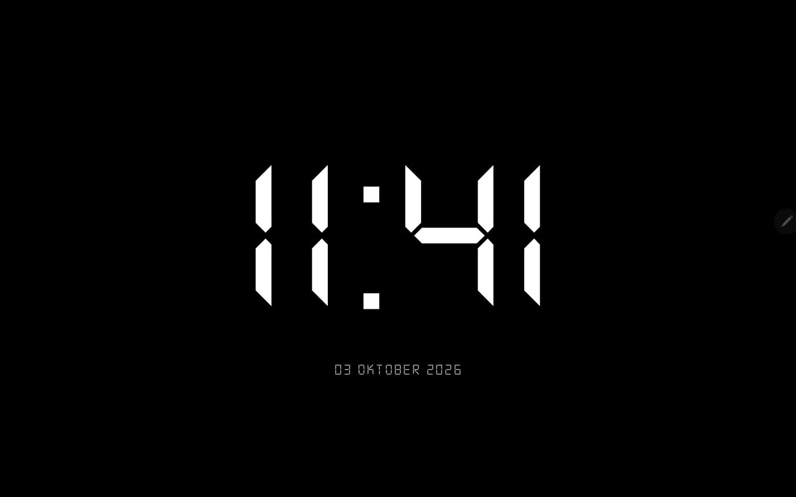

<p align="center">
  
</p>

# OBS Countdown Timer

A clean fullscreen countdown timer designed to replace your camera feed through **OBS Virtual Camera** for online meetings, presentations, livestreams, classes, and events.

Built with simple **HTML, CSS, and JavaScript**, the timer runs directly in a browser and is controlled entirely through keyboard shortcuts, keeping the final output clean with no visible buttons or controls.

---

## Overview

OBS Countdown Timer is a lightweight browser-based timer designed for use with **OBS Studio**.

The timer can be displayed in OBS and sent as a video output through **OBS Virtual Camera**, allowing it to temporarily replace a webcam feed during meetings, presentations, classes, livestreams, or online events.

It can be used with platforms such as:

- Zoom
- Google Meet
- Microsoft Teams
- OBS Studio
- Livestreaming platforms
- Online classes
- Presentations
- Webinars
- Events

---

## Features

- Clean fullscreen countdown display
- Large digital-style timer
- Black background with high-contrast white text
- No visible control buttons
- Keyboard-controlled operation
- Start, pause, and reset controls
- Quick timer presets
- Lightweight single-file application
- No installation required
- Works directly in a web browser
- Suitable for OBS Virtual Camera output

---

## Keyboard Shortcuts

| Key | Action |
| --- | --- |
| `S` | Start countdown |
| `P` | Pause countdown |
| `R` | Reset countdown |
| `1` | Set timer to 10 minutes |
| `2` | Set timer to 24 minutes |

---

## How It Works

The countdown timer runs directly inside the browser.

The default timer is:

```text
10:00
```

The timer automatically updates every second.

Instead of displaying buttons on screen, all controls are handled through keyboard shortcuts so the output remains clean when captured in OBS.

---

## Using with OBS Studio

### 1. Open the Timer

Open:

```text
index.html
```

in your web browser.

### 2. Add the Timer to OBS

Open **OBS Studio** and capture the timer using a suitable source such as a browser or window capture.

Adjust the source until the countdown fills the OBS canvas.

### 3. Start OBS Virtual Camera

In OBS Studio, click:

```text
Start Virtual Camera
```

### 4. Select OBS as Your Camera

Open your meeting or presentation platform and select:

```text
OBS Virtual Camera
```

as the camera source.

The countdown will now appear instead of your normal webcam feed.

---

## Example Workflow

```text
Countdown HTML
      ↓
Web Browser
      ↓
OBS Studio
      ↓
OBS Virtual Camera
      ↓
Zoom / Meet / Teams / Other Platform
```

---

## Tech Stack

- HTML5
- CSS3
- JavaScript
- OBS Studio
- OBS Virtual Camera

---

## Project Structure

```text
obs-countdown-timer/
│
├── index.html
├── screenshot.png
├── README.md
└── LICENSE
```

---

## Running the Project

No installation or additional dependencies are required.

Simply clone the repository:

```bash
git clone https://github.com/hanifhibatulloh-dev/obs-countdown-timer.git
```

Then open:

```text
index.html
```

in your preferred web browser.

---

## Why This Project?

During online meetings, presentations, classes, or events, there are situations where a countdown needs to temporarily replace the normal camera feed.

This project provides a simple solution with a clean fullscreen interface and keyboard shortcuts, making it easy to control without displaying unnecessary buttons to the audience.

---

## Future Improvements

Possible future improvements include:

- Custom countdown duration
- Additional timer presets
- Keyboard shortcut customization
- Custom timer colors
- Transparent background mode
- Custom fonts
- Warning color near zero
- Sound notification
- Count-up mode
- OBS Browser Source optimization

---

## Author

**Muhammad Hanif Hibatulloh**

Computer Science Student  
Universitas Jenderal Achmad Yani

[GitHub](https://github.com/hanifhibatulloh-dev)

[LinkedIn](https://www.linkedin.com/in/muhammad-hanif-hibatulloh)

---

## License

This project is licensed under the **MIT License**.

---

<p align="center">
  <b>Turn your camera feed into a clean fullscreen countdown.</b>
</p>
